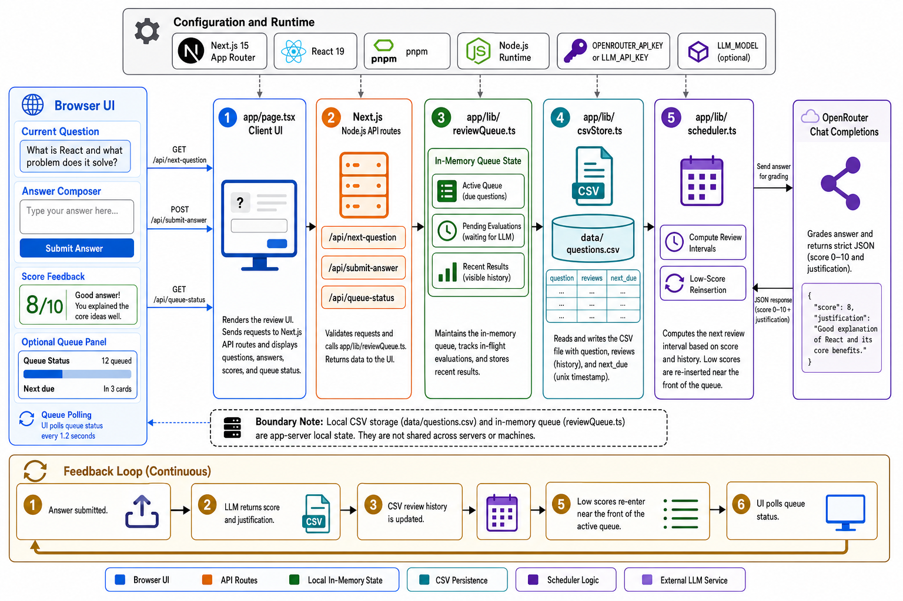

<div align="center">
  

  **🧠 Fast free-text flashcard review 🧠**
</div>

waxon is a Next.js app for practicing recall with typed answers. It serves due questions, sends each answer for LLM grading, stores the score history in Postgres, and schedules the next review from that score.

The app is built for a single local or single-server review loop. A small queue panel shows active cards, pending evaluations, recent scores, and upcoming due times.

## Install

```bash
git clone https://github.com/tsilva/waxon.git
cd waxon
pnpm install
pnpm dev
```

Open [http://localhost:3000](http://localhost:3000).

Database storage uses Neon Postgres through Drizzle. Create `.env` with your Neon connection string:

```bash
DATABASE_URL=your-pooled-neon-connection-string
```

For migrations, prefer adding Neon's direct connection string too:

```bash
DATABASE_URL_UNPOOLED=your-direct-neon-connection-string
```

Apply database migrations before running the app against a new database:

```bash
pnpm db:migrate
```

For answer grading, create `.env.local` with an OpenRouter-compatible API key:

```bash
OPENROUTER_API_KEY=your-api-key
LLM_MODEL=openai/gpt-5.5
```

`LLM_MODEL` is optional. The app also accepts `LLM_API_KEY` if `OPENROUTER_API_KEY` is not set.

## Commands

```bash
pnpm dev        # start the local Next.js dev server
pnpm build      # build the production app
pnpm db:generate # generate Drizzle migrations from app/db/schema.ts
pnpm db:migrate  # apply pending migrations
pnpm db:studio   # open Drizzle Studio
pnpm start      # run the production build
pnpm lint       # run ESLint
pnpm typecheck  # run TypeScript without emitting files
```

## Notes

- Questions and review history live in Neon Postgres.
- If the configured deck has no questions, the app bootstraps it from `data/questions.csv`.
- The app currently hardcodes `tsilva` as the authenticated user.
- The `users` table owns `decks`; the default deck is `Deep Learning`.
- The `questions` table stores per-card state and is associated to a deck with `deck_id`.
- The `question_attempts` table stores every resolved user attempt with its `deck_id`: raw answer, concise LLM answer summary, score, justification, and timestamps.
- Review queue state and pending evaluations are kept in memory for the current server process.
- API routes run on the Node.js runtime and are forced dynamic.
- Without `OPENROUTER_API_KEY` or `LLM_API_KEY`, submitted answers are recorded with a `0` score and a configuration message.
- Database schema lives in `app/db/schema.ts`; generated migrations live in `drizzle/`.
- Dependency hardening is enabled in both `pnpm-workspace.yaml` and `.npmrc`.

## Architecture



## License

No license file or package license is currently included.
